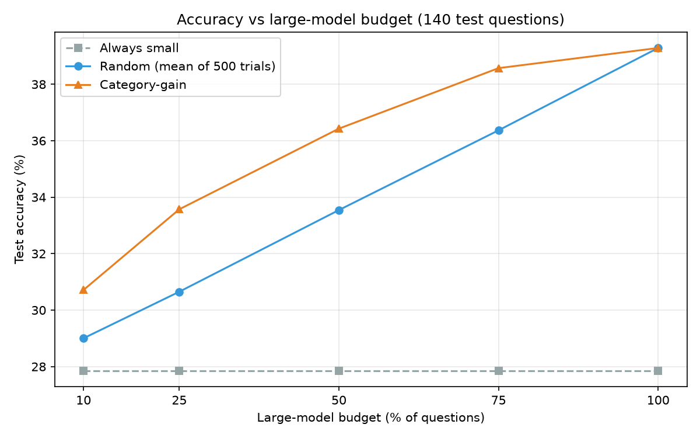
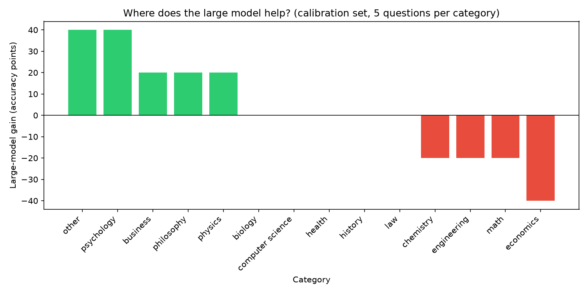

# Small-Model Routing Under a Fixed Inference Budget

## 1. Problem

Big AI models are smart but expensive to run. Small models are cheap but
not as smart.

Think of it like a hospital: you don't need a brain surgeon for every
patient. A nurse can handle most problems, and you only call the surgeon
for the cases where the surgeon's extra skill actually matters. This
project asks: **can we do the same thing with AI models?**

## 2. Research question

> If we're only allowed to use the big, expensive model on *some*
> questions, can we pick *which* questions smartly — and do better than
> just picking randomly?

## 3. Models

Two models, both running **on my own Mac** (no internet APIs, no cloud,
no costs per question):

| Model | Size | Think of it as |
|---|---|---|
| Qwen3-1.7B (4-bit) | ~1 GB | The nurse — fast and cheap, handles most things |
| Qwen3-4B (4-bit) | ~2.15 GB | The surgeon — slower, costs more, but more capable |

## 4. Calibration (learning where the bigger model helps)

Before we can route questions, we need to know: *for which kinds of
questions is the big model actually worth it?*

To find out, we gave both models **70 practice questions** (the MMLU-Pro
validation set — 5 questions from each of 14 subjects like math, history,
and law). For each subject, we computed:

```
gain = big model's accuracy − small model's accuracy
```

A real example from our results:

```
Psychology:  small model 40%, big model 80%  →  gain = +40 points
             (the big model helps A LOT here)

History:     small model 40%, big model 40%  →  gain = 0 points
             (the big model adds NOTHING here)

Economics:   small model 60%, big model 20%  →  gain = −40 points
             (the big model is actually WORSE here!)
```

This table of gains is the entire "brain" of our router. No machine
learning, no neural network — just a sorted list.

**Important fairness rule:** we only used the 70 practice questions to
build this table. The real test questions were kept hidden until the
final exam.

## 5. Routing policies (three ways to spend the budget)

Say the budget is 25% — we can use the bigger model on only 35 of 140 test
questions. Who gets it? We compared three strategies:

- **Always small** — nobody gets the big model. The cheapest option;
  our baseline for comparison.
- **Random** — pull 35 names out of a hat. To be fair, we repeated the
  lottery 500 times and averaged the results (one lucky draw shouldn't
  count).
- **Category-gain (our router)** — give the big model to subjects with
  the biggest gains first. Psychology questions go to the big model
  before history questions do, because that's where it helps most.

## 6. Results

The final exam: **140 brand-new questions** the router had never seen
(10 per subject).

| Big-model budget | Always small | Random | Category-gain (ours) |
|---:|---:|---:|---:|
| 10% | 27.9% | 29.0% | **30.7%** |
| 25% | 27.9% | 30.7% | **33.6%** |
| 50% | 27.9% | 33.5% | **36.4%** |
| 75% | 27.9% | 36.4% | **38.6%** |
| 100% | 27.9% | 39.3% | 39.3% |



And here's where the big model helped (or hurt) during practice:



**Time savings:** using the small model for everything took 12.2 seconds;
using the big model for everything took 26.4 seconds. Our router at a 25%
budget took just 14.2 seconds — only 2 seconds more than the cheapest
option, but with noticeably better accuracy.

## 7. Findings (what we learned)

- **Smart routing works.** Our simple table beat random routing at every
  single budget. Picking *which* questions go to the big model is better
  than picking randomly — even when the picking rule comes from just 70
  practice questions.
- **The bigger model's usefulness depends a lot on the subject.** Sometimes
  it helps enormously (+40 points in psychology), sometimes it does
  nothing (history), and sometimes it's actually *worse* (−40 in
  economics). Knowing this is valuable — random routing would waste money
  sending economics questions to a model that answers them worse.
- **You don't need the bigger model for everything.** Half the budget (50%)
  already captured most of the big model's total benefit. Going from 50%
  to 100% barely helped.
- **Small savings add up.** At a 25% budget we gained +5.7 accuracy
  points over the cheap baseline for only +2 seconds of compute.

## 8. Limitations (being honest)

- **We only tested one model family** (Qwen3). Other models might behave
  differently.
- **Subjects are a crude signal.** "Math" covers easy and hard questions;
  ideally we'd route question-by-question, not subject-by-subject.
- **Small practice set.** Only 5 practice questions per subject, so one
  lucky or unlucky question swings a subject's gain by 20 points.
- **Small exam.** 140 test questions, one random seed.
- **One computer.** The timing numbers are specific to this Mac.

## 9. Reproduce

```bash
# Setup (Python 3.12, Apple Silicon Mac)
python3.12 -m venv venv
source venv/bin/activate
pip install -r requirements.txt

# Download the two models into models/ (not included in this repo)
#   mlx-community/Qwen3-1.7B-4bit  -> models/Qwen3-1.7B-4bit/
#   mlx-community/Qwen3-4B-4bit    -> models/Qwen3-4B-4bit/

# Step 1: practice round (70 questions x 2 models)
python run_calibration.py

# Step 2: the real experiment (140 questions x 2 models + routing + plots)
python run_experiment.py
```

Results appear in `results/` and `results/figures/`.
